# Smart Student Hub & Admin CMS


## 📑 Table of Contents
- [Project Description](#project-description)
- [App Screenshots](#app-screenshots)
- [Admin CMS Screenshots](#admin-cms-screenshots)
- [Key Features](#key-features)
  - [Student Mobile Application](#student-mobile-application)
    - [📅 Event Management](#📅-event-management)
    - [🗓️ Calendar Integration](#️🗓️-calendar-integration)
    - [👥 Group Interactions](#👥-group-interactions)
    - [🤖 AI Chatbot Assistant](#🤖-ai-chatbot-assistant)
    - [👤 Profile Management](#👤-profile-management)
    - [🎨 User Experience](#🎨-user-experience)
  - [Admin Content Management System](#admin-content-management-system)
    - [📊 Dashboard](#📊-dashboard)
    - [➕ Event Creation](#➕-event-creation)
    - [⚙️ Event Management](#️⚙️-event-management)
    - [📋 Applicant Tracking](#📋-applicant-tracking)
    - [✏️ Profile Management](#✏️-profile-management-1)
- [Technology Stack](#technology-stack)
  - [Frontend](#frontend)
  - [Backend](#backend)
  - [Database](#database)
  - [AI & Machine Learning](#ai--machine-learning)
  - [Data Collection](#data-collection)
  - [Deployment](#deployment)
- [Architecture Overview](#architecture-overview)
- [Core Modules & Contexts](#core-modules--contexts)
- [Setup Guide](#setup-guide)  
- [License](#license)


## Project Description

 - **Unified Event Platform**: Single interface for discovering and registering for all types of events
- **AI-Powered Chatbot**: Instant academic support and personalized event recommendations with benefit explanations
- **Interest-Based Groups**: Academic and social connection tools with real-time chat functionality
- **ML Recommendations**: K-Nearest Neighbors algorithm for personalized event suggestions
- **Admin Dashboard**: Comprehensive CMS with real-time analytics and streamlined event management

---
## App Screenshots
<table>
  <tr>
    <td align="center"><b>Login Page</b><br>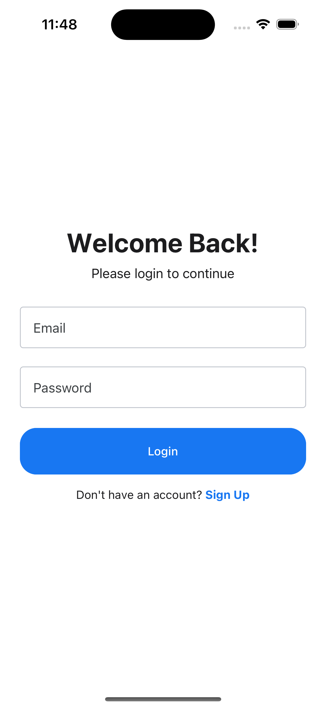</td>
    <td align="center"><b>Home Page</b><br>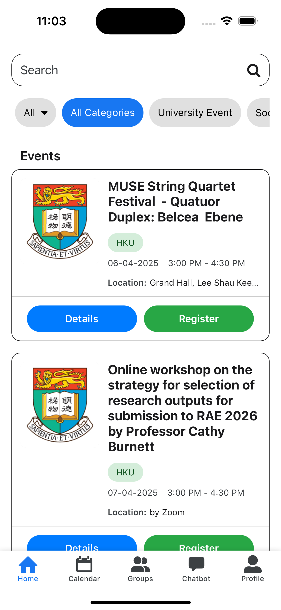</td>
  </tr>
  <tr>
    <td align="center"><b>Calendar Page</b><br>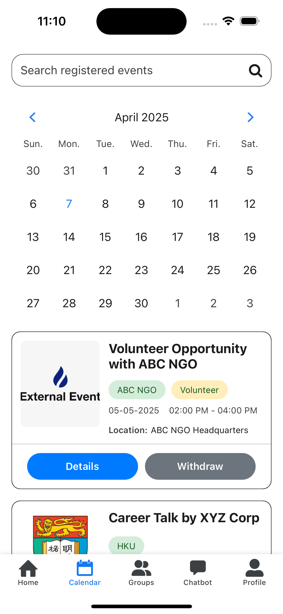</td>
    <td align="center"><b>Groups Page</b><br>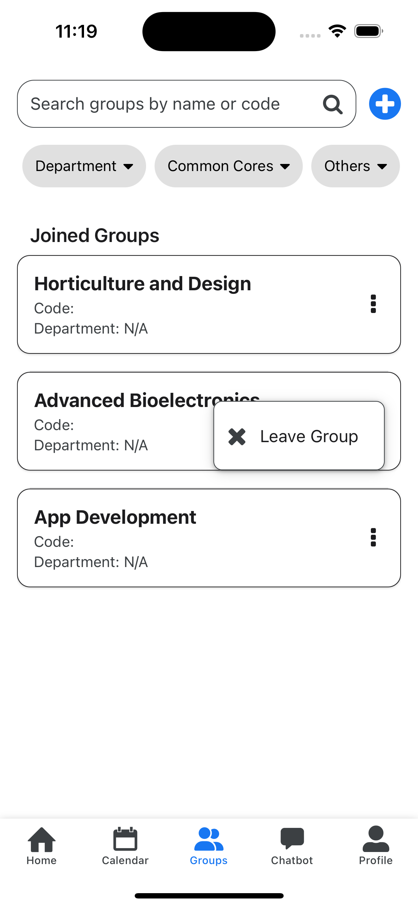</td>
  </tr>
  <tr>
    <td align="center"><b>Chatbot Page</b><br>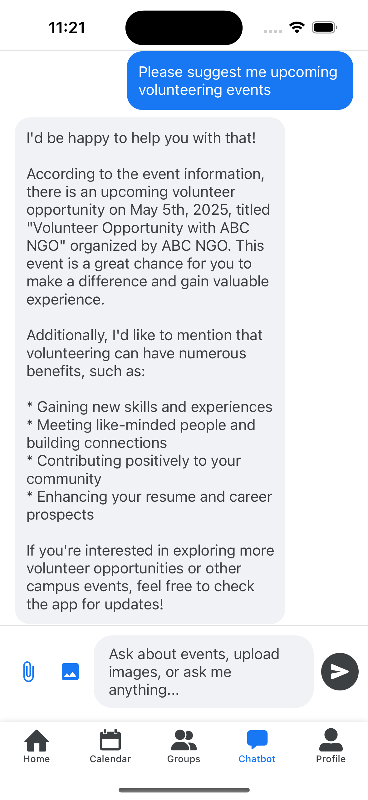</td>
    <td align="center"><b>Profile Page</b><br>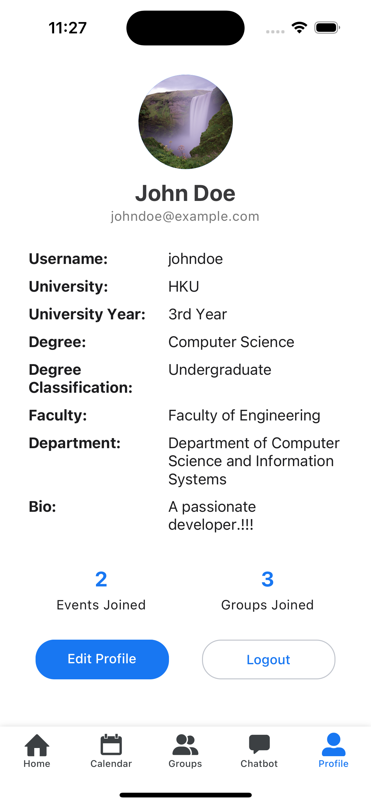</td>
  </tr>
</table>

---

## Admin CMS Screenshots

<table>
  <tr>
    <td align="center"><b>Login Page</b><br>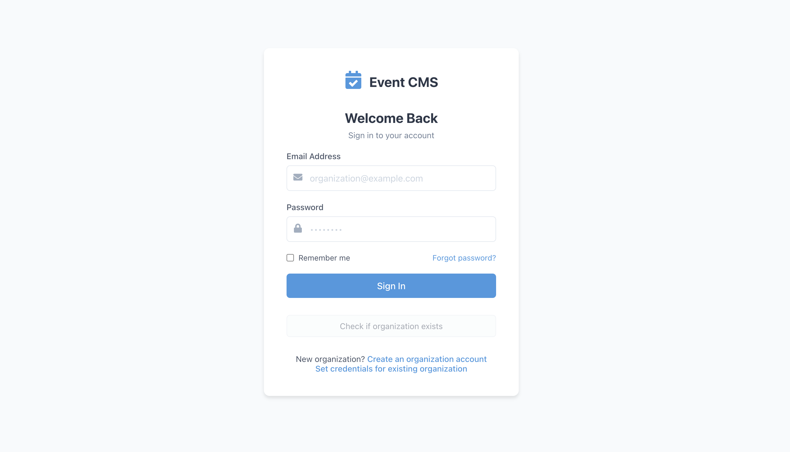</td>
    <td align="center"><b>Dashboard Page</b><br>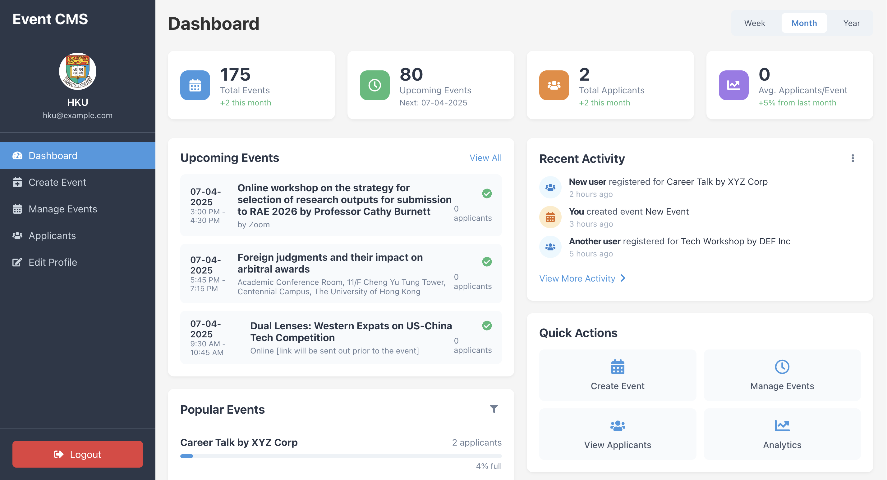</td>
  </tr>
  <tr>
    <td align="center"><b>Create Event Page</b><br>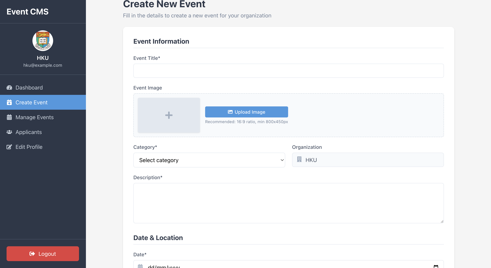</td>
    <td align="center"><b>Manage Event Page</b><br>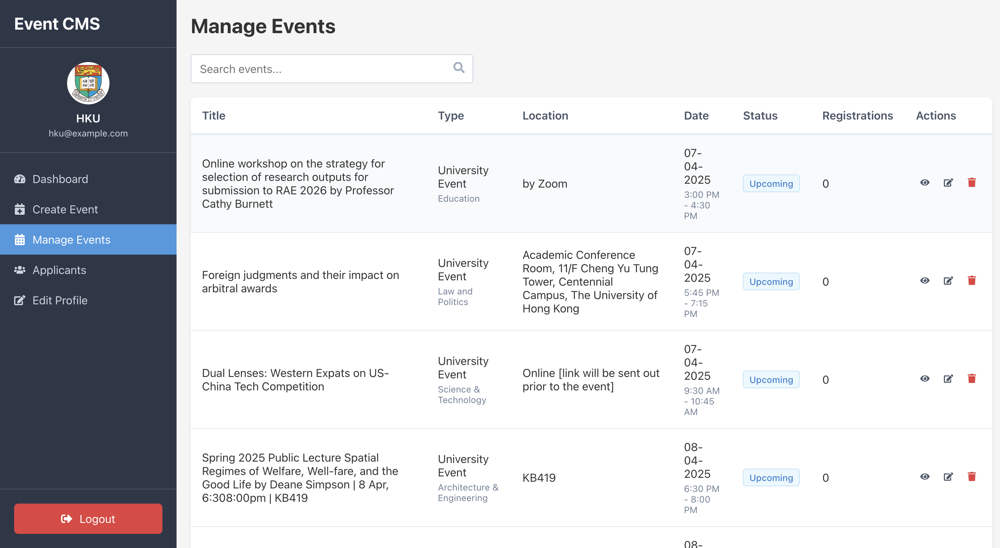</td>
  </tr>
  <tr>
    <td align="center"><b>Edit Profile Page</b><br>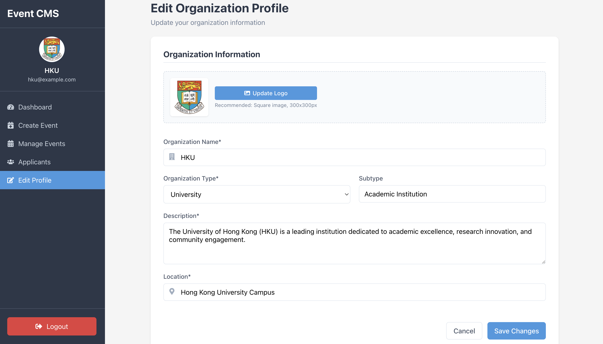</td>
    <td align="center"><b>Applicant Page</b><br>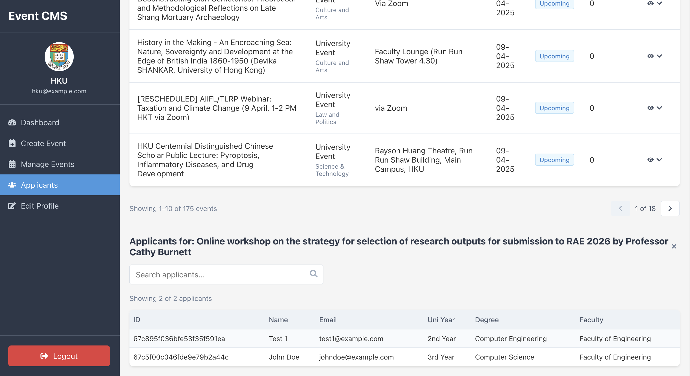</td>
  </tr>
</table>

---

## Key Features

### Student Mobile Application

#### 📅 Event Management
- **Unified Event Discovery**: Browse university events, society activities, and external opportunities in one place
- **Smart Filtering**: Filter by category, timeframe, and search by keywords
- **One-Click Registration**: Streamlined registration with pre-filled user information
- **Event Recommendations**: ML-powered (KNN model) suggestions based on user preferences and similar users' registrations

#### 🗓️ Calendar Integration
- **Visual Event Calendar**: Interactive calendar widget showing all registered events
- **Chronological Event List**: Easy-to-scan list of upcoming commitments

#### 👥 Group Interactions
- **Academic Groups**: Join study groups by department, course code, or common core
- **Interest-Based Communities**: Connect with peers sharing similar extracurricular interests
- **Real-Time Chat**: WebSocket-powered instant messaging using Socket.IO
- **Group Creation**: Create new groups with customizable details and descriptions

#### 🤖 AI Chatbot Assistant
- **Event Information**: Get instant answers about upcoming events and their benefits
- **Academic Support**: 24/7 assistance for academic queries (92% accuracy rate for event-related questions)
- **Image Analysis**: Upload lecture slides or event posters for OCR text extraction
- **General Knowledge**: Answer general questions with 85% accuracy
- **Motivational Context**: Explains event benefits to encourage participation (90% relevant response rate)

#### 👤 Profile Management
- **Personal Information**: Display and edit academic details, bio, and profile picture
- **Activity Statistics**: Track registered events and joined groups


#### 🎨 User Experience
- **Dark/Light Mode**: Full theme compatibility with device settings
- **Responsive Design**: Optimized for various screen sizes and orientations
- **Cross-Platform**: Built with React Native for iOS and Android compatibility

---

### Admin Content Management System

#### 📊 Dashboard
- **Real-Time Metrics**: Total events, upcoming events, applicants, and average attendance

#### ➕ Event Creation
- **Comprehensive Form**: All event details including title, category, description, dates, and pricing
- **Image Upload**: Add event banners with automatic resizing and preview

#### ⚙️ Event Management
- **Tabular View**: Clear overview of all organization events with key metrics
- **Search & Pagination**: Efficiently navigate through large event lists
- **Quick Actions**: View, edit, and delete events with modal interfaces

#### 📋 Applicant Tracking
- **Registration Lists**: View all applicants for each event
- **User Details**: Access full applicant profiles including academic information
- **Export Functionality**: Download applicant lists as Excel files

#### ✏️ Profile Management
- **Organization Details**: Update name, description, location, and logo
- **Logo Preview**: Visual confirmation of organization branding

---

## Technology Stack

### Frontend

**Student Mobile App:**
- **React Native**: Cross-platform mobile development
- **Expo Go**: Development and testing environment
- **React Navigation**: Screen navigation and routing
- **Socket.IO Client**: Real-time messaging
- **React Native Calendars**: Calendar widget implementation
- **Styled Components**: Component-based styling

**Admin Web CMS:**
- **ReactJS**: Web application framework
- **React Router**: Client-side routing
- **Styled Components**: CSS-in-JS styling
- **Axios**: HTTP client for API requests

### Backend

- **Node.js**: Runtime environment
- **Express.js**: Web application framework
- **Socket.IO**: WebSocket server for real-time communication
- **Mongoose**: MongoDB object modeling
- **JWT**: JSON Web Tokens for authentication
- **bcryptjs**: Password hashing
- **Multer**: File upload handling
- **CORS**: Cross-origin resource sharing

### Database

- **MongoDB**: NoSQL document database

### AI & Machine Learning

**Large Language Models:**
- **Ollama**: Local LLM deployment platform
- **Llama 3 (8B)**: Fine-tuned for event-specific queries
- **LLaVA (7B)**: Multimodal image understanding
- **Nomic Embed Text**: Text embedding generation

**Recommendation System:**
- **K-Nearest Neighbors (KNN)**: User-based collaborative filtering
- **Cosine Similarity**: Distance metric for user comparison

**Vector Database:**
- **HNSWLib**: Hierarchical Navigable Small World graphs for similarity search

**OCR & Image Processing:**
- **Tesseract.js**: Optical character recognition


### Data Collection

- **Python**: Web scraping scripts
- **BeautifulSoup**: HTML parsing
- **Requests**: HTTP library

### Deployment

- **Microsoft Azure**: Cloud hosting for Admin CMS
- **Azure Virtual Machine**: NGINX reverse proxy with Let's Encrypt SSL
- **MongoDB Atlas**: Database cloud hosting
- **Expo**: Mobile app development and testing platform

---

## Architecture Overview

```
┌─────────────────────────────────────────────────────────────┐
│                     Client Applications                     │
├──────────────────────────────┬──────────────────────────────┤
│   Student Mobile App         │      Admin Web CMS           │
│   (React Native + Expo)      │      (ReactJS)               │
└──────────────┬───────────────┴────────────┬─────────────────┘
               │                            │
               │  RESTful API / WebSocket   │
               │                            │
┌──────────────┴────────────────────────────┴────────┐
│                    Backend Server                  │
│              (Node.js + Express.js)                │
├────────────────────────────────────────────────────┤
│  • Authentication Middleware (JWT)                 │
│  • API Routes & Controllers                        │
│  • Socket.IO Server (Real-time Chat)               │
│  • Business Logic Services                         │
└────┬─────────┬────────────┬──────────────┬─────────┘
     │         │            │              │             
     ▼         ▼            ▼              ▼            
┌─────────┐ ┌─────┐  ┌──────────┐  ┌──────────┐  
│ MongoDB │ │ LLM │  │  Vector  │  │   KNN    │ 
│  Atlas  │ │(Llama│ │ Database │  │  Model   │ 
│         │ │LLaVA)│ │(HNSWLib) │  │          │  
└─────────┘ └─────┘  └──────────┘  └──────────┘  

```
---

## Core Modules & Contexts

- **AuthContext**: Login/signup/logout, AsyncStorage sync, token refresh, interceptor-based 401 handling.
- **RegisteredEventsContext**: Events catalogue, registration state, modal triggers, countdown to event capacity.
- **GroupsContext**: Joined/available group caching, optimistic updates, server reconciliation.
- **OrganizationsContext**: Admin organization metadata, fetch caching, seeding support.
- **RecommendationsContext**: Content vs ML toggles, call deduplication, status messaging.
- **ThemeContext**: Appearance listener, dynamic theme swapping, Redux-free theming.

---

## Setup Guide

### 1. Clone & Install

git clone https://github.com/AsadNaveed1/Project-SmartStudentHub-AdminCMS.git
cd <project-root>


### 2. Configure Backend (`server/`)

npm install
npm run dev     


### 3. Run ML Recommender (`services/ml-recommender/`)

python -m venv .venv
source .venv/bin/activate         
pip install -r requirements.txt
python ml_recommender.py           


### 4. Seed Events (Optional)

cd tools/scraper
python scrape_hku_events.py  


### 5. Fine-Tune LLM (Optional)

node tools/createFineTuningDataset.js 
node tools/fineTuneOllama.js  


### 6. Launch Student App (`mobile/`)

npm install
expo start


### 7. Launch Admin CMS (`web/`)

npm install
npm run dev                 


## License

MIT License © 2025  

